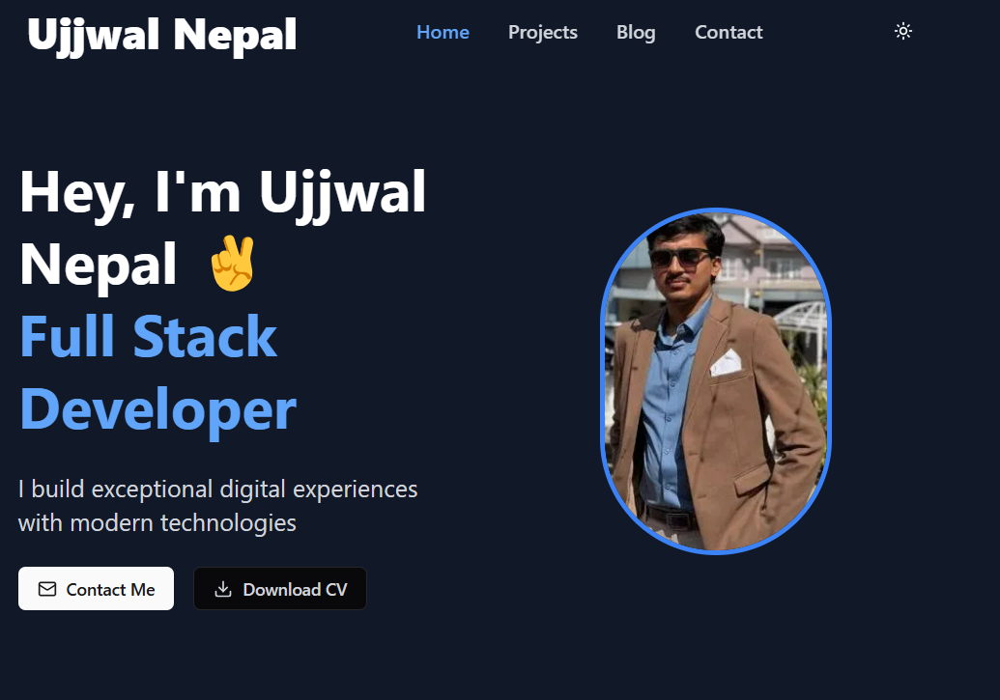

# Ujjwal Nepal - Personal Portfolio

<div align="center">
  
</div>

[](https://nextjs.org/)
[](LICENSE)

A modern, responsive portfolio website built with Next.js, featuring interactive UI components, blog integration via Hashnode, and a contact form powered by Formspree.

## ✨ Live Demo

Check out the live site: [ujjwalnepal.com](https://ujjwal-nepal.vercel.app/)

## 🛠️ Technologies Used

- **Framework**: [Next.js 15](https://nextjs.org/)
- **Styling**: [Tailwind CSS](https://tailwindcss.com/)
- **UI Components**:
  - Custom rotating card components
  - Interactive animations
  - Responsive design
- **Blog Integration**: [Hashnode API](https://hashnode.com/)
- **Form Backend**: [Formspree](https://formspree.io/)
- **Deployment**: Vercel

## 🌟 Features

- **Interactive UI** - Engaging user experience with animated components
- **Responsive Design** - Looks great on all devices from mobile to desktop
- **Project Showcase** - Highlighting projects with rotating card displays
- **Blog Section** - Integrated with Hashnode for seamless content management
- **Contact Form** - Easy to use contact form with Formspree backend
- **Dark/Light Mode Toggle** - Customizable viewing experience
- **SEO Optimized** - Built with performance and search visibility in mind

## 🚀 Getting Started

### Prerequisites

- Node.js 18.x or later
- npm or yarn package manager

### Installation

1. Clone the repository:
   ```bash
   git clone https://github.com/ujjwal-207/Ujjwal_Nepal.git
   cd Ujjwal_Nepal
   ```

2. Install dependencies:
   ```bash
   npm install
   # or
   yarn install
   ```


3. Run the development server:
   ```bash
   npm run dev
   # or
   yarn dev
   ```

4. Open [http://localhost:3000](http://localhost:3000) with your browser to see the result.

## 📝 Project Structure

```
Ujjwal_Nepal/
├── components/        # Reusable UI components
├── lib/               # Utility functions and API clients
├── pages/             # Next.js pages
│   ├── api/           # API routes
│   ├── blog/          # Blog pages with Hashnode integration
│   ├── projects/      # Project showcase pages
│   └── contact/       # Contact page with Formspree
├── public/            # Static assets
│   └── assets/        # Images and other assets
├── styles/            # Global styles
└── utils/             # Helper functions
```

## 🔧 Configuration

### Hashnode Blog Integration

The portfolio fetches blog posts from Hashnode using their GraphQL API. To customize:

1. Update the Hashnode username in `lib/hashnode.js`
2. Modify the query to fetch the data you need

### Formspree Setup

1. Create a form on [Formspree](https://formspree.io/) 
2. The contact form component will handle the rest

## 🎨 Customization

- **Theme**: Edit the theme colors in `tailwind.config.js`
- **Content**: Update personal information in `data/` directory
- **Layout**: Modify components in the `components/` directory

## 📱 Responsive Design

The portfolio is designed to work flawlessly across all devices:
- Mobile-first approach
- Breakpoints for tablet and desktop
- Optimized images and assets

## 🤝 Contributing

Contributions are welcome! Feel free to open an issue or submit a pull request.

1. Fork the repository
2. Create your feature branch (`git checkout -b feature/amazing-feature`)
3. Commit your changes (`git commit -m 'Add some amazing feature'`)
4. Push to the branch (`git push origin feature/amazing-feature`)
5. Open a Pull Request

## 📄 License

This project is licensed under the MIT License - see the [LICENSE](LICENSE) file for details.

## 👤 Contact

Ujjwal Nepal - [ujjwalnepal715@gmail.com](mailto:ujjwalnepal715@gmail.com)

Project Link: [https://github.com/ujjwal-207/Ujjwal_Nepal](https://github.com/ujjwal-207/Ujjwal_Nepal)

---

<div align="center">
  <p>Built with ❤️ by Ujjwal Nepal</p>
</div>
